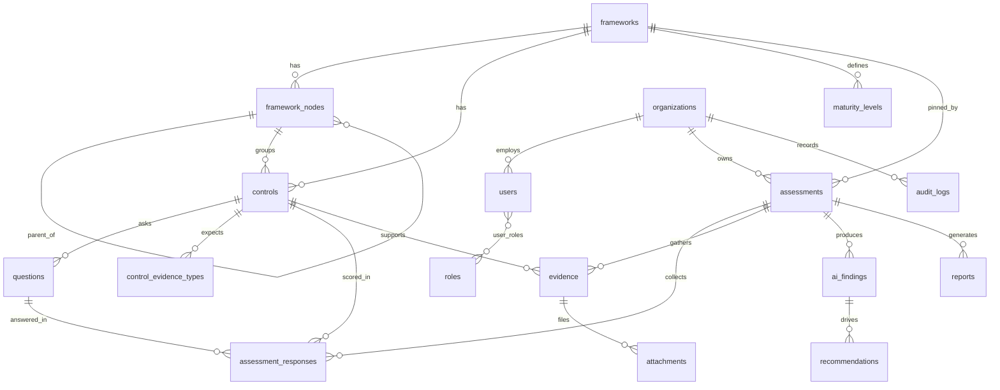

# CyberAI — Database Architecture

> The definitive design document for the CyberAI assessment platform's data layer.
> Covers analysis, rationale, every table/column, keys, constraints, indexes,
> scalability, tradeoffs, and the PostgreSQL migration path.

---

## 1. Architecture overview

The database is split into **two layers**:

| Layer | Purpose | Mutability | Tenancy |
|-------|---------|------------|---------|
| **Catalog** | The framework *library* — frameworks, hierarchy, controls, questions, maturity models. Generated from `f_data/*.json`. | Read-mostly, versioned | Shared (global) |
| **Runtime** | The assessment *lifecycle* — organizations, users, assessments, answers, evidence, AI findings, recommendations, reports, audit. | Read/write | Per-tenant |

This is the same separation used by Drata, Vanta, and Secureframe: a versioned control library that many customers reference, and per-customer operational data that *points at a pinned version* of that library.

```
CATALOG (library)                         RUNTIME (per-tenant)
─────────────────                         ────────────────────
frameworks ──┬─ framework_nodes (self-ref)      organizations ─ users ─ user_roles ─ roles
             ├─ maturity_levels                 assessments ──┬─ assessment_responses
             └─ controls ──┬─ questions                       ├─ evidence ─ attachments
                           └─ control_evidence_types          ├─ ai_findings ─ recommendations
                                                              ├─ reports
   assessments.framework_id ───────► frameworks.id            └─ audit_logs
   responses.question_id  ─────────► questions.id
```

---

## 2. Why this architecture

The design is driven by **what the JSON actually contains**, not what the brief assumed.

**Finding: the five files use three different schemas.**

| Shape | Files | Structure | Questions | Evidence | Maturity |
|-------|-------|-----------|-----------|----------|----------|
| Flat | nist, iso, cis | flat array; `domain`/`category` are codes | 1 inline | `requires_evidence` bool | — |
| PCI | pci | `domain → sub_domain → control` (+ metadata) | none | `expected_evidence_types[]` | per-control strings |
| Market | market | `domain → category → control` (rich) | 5–6 typed | `expected_evidence_types[]` | framework model + per-control guide |

Consequences that shaped the schema:

1. **Inconsistent hierarchy depth and naming** (`category` vs `sub_domain`, 2–3 levels, future frameworks unknown) → a **self-referencing `framework_nodes` table** instead of fixed `Domain`/`Category` tables. New nesting shapes need *no schema change*.
2. **PCI duplicates every control** under both the domain and its sub-domains (100% overlap) → the importer de-duplicates and treats the sub-domain path as authoritative.
3. **0, 1, or N questions per control** → `questions` is its own table; controls with none get one clearly-flagged synthesized question so the answer workflow is uniform.
4. **Market's ~14 control attributes exist in no other framework** → universal fields become columns; framework-specific extras live in a JSON `attributes` column (avoids a wide, mostly-NULL table).
5. **Frameworks are versioned** (PCI 4.0, Market 2.0) → `(code, version)` is the framework key and assessments pin `framework_id`, so publishing a new version never rewrites history.

---

## 3. Database hierarchy

```
frameworks (a specific version of a framework)
└── framework_nodes            recursive tree (domain → category/sub_domain → …)
    └── controls               atomic assessable item (parented to a leaf node)
        ├── questions          0..N; what an assessor actually answers
        └── control_evidence_types   expected evidence
frameworks
└── maturity_levels            framework-level maturity model (e.g. Market 0–3)
```

Runtime hierarchy:

```
organizations
├── users ── user_roles ── roles
└── assessments (pins one frameworks.id)
    ├── assessment_responses (one per question)
    ├── evidence ── attachments
    ├── ai_findings ── recommendations
    ├── reports
    └── audit_logs
```

---

## 4. ER diagram



---

## 5–7. Tables, columns, primary keys

Every table uses a surrogate `INTEGER PRIMARY KEY` (SQLite rowid alias; maps to
`BIGINT GENERATED ALWAYS AS IDENTITY` in PostgreSQL). Natural keys are enforced
with `UNIQUE` constraints alongside the surrogate.

### Catalog

**frameworks** — one framework version.
| Column | Notes |
|--------|-------|
| id (PK) | surrogate |
| code | stable machine code (`NIST_CSF`, `PCI_DSS`) |
| name, version | version pins the library; `UNIQUE(code, version)` |
| description, source_format, source_file | provenance |
| external_uuid | source `framework_id` |
| scoring_scale | JSON (Market's 0–3 scale) |
| ingested_at, created_at | timestamps |

**framework_nodes** — recursive hierarchy.
| Column | Notes |
|--------|-------|
| id (PK) | |
| framework_id (FK) | owning framework |
| parent_id (FK→self) | NULL = root/domain |
| node_type | descriptive: `domain`/`category`/`sub_domain` |
| code | source id; `UNIQUE(framework_id, code)` |
| name | falls back to code when source has no name |
| description, criteria_statement | Market domain/category text |
| sort_order | preserves source ordering |
| attributes | JSON (point_of_contact, red_flags…) |

**controls** — atomic assessable item.
| Column | Notes |
|--------|-------|
| id (PK) | |
| framework_id (FK) | denormalized for fast per-framework queries |
| node_id (FK) | immediate parent group (leaf node) |
| control_id | source id; `UNIQUE(framework_id, control_id)` |
| name | control_name / sub_topic (often empty) |
| statement | the control text |
| requires_evidence | 0/1 |
| sort_order | |
| attributes | JSON — framework-specific extras (item_type, maturity_guide…) |

**questions** — what an assessor answers (0..N per control).
| Column | Notes |
|--------|-------|
| id (PK), control_id (FK) | |
| question_code | source question_id |
| text, question_type | `YES_NO`/`FREE_TEXT`/`MULTI_CHOICE`/`MATURITY_SCALE`/`NUMERIC` |
| choices | JSON (multi-choice options) |
| help_text, weight | scoring inputs |
| is_synthesized | 1 = generated because source had no question |
| sort_order | |

**maturity_levels** — framework-level maturity model. `UNIQUE(framework_id, level)`.

**control_evidence_types** — normalized `expected_evidence_types[]`. `UNIQUE(control_id, evidence_type)`.

### Runtime

**organizations** — tenant root (`slug` unique).
**users** — `email` unique, `organization_id` FK.
**roles / user_roles** — RBAC; `user_roles` is the M:N join (composite PK).
**assessments** — pins `framework_id`; `status` CHECK enum; score + lifecycle timestamps.
**assessment_responses** — one row per `(assessment, question)` (unique); carries `answer_value`, `answer_score`, `maturity_level`, denormalized `control_id` for reporting.
**evidence** — logical evidence claim tied to assessment + control (+ optional response).
**attachments** — physical files under an evidence item (checksum, size, mime).
**ai_findings** — AI output: `finding_type` + `severity` enums, `confidence`, `model_name`.
**recommendations** — remediation; optional link to `finding_id`; priority/effort/status enums.
**reports** — generated deliverables; `score_snapshot` JSON; `version` for regenerations.
**audit_logs** — append-only generic change history; `changes` JSON `{before, after}`.

---

## 8. Foreign keys

All FKs declare `ON DELETE` intent explicitly:

- **CASCADE** where the child cannot exist without the parent and should die with it:
  framework_nodes, controls, questions, control_evidence_types, maturity_levels
  (all under frameworks); assessment_responses/evidence/ai_findings/recommendations/reports
  (under assessments); attachments (under evidence); users (under organizations).
- **RESTRICT** where deletion must be blocked to protect history:
  `assessments.framework_id` (can't drop a framework an assessment used),
  `assessment_responses.question_id`/`control_id`.
- **SET NULL** for optional actor/reference links that may outlive their target:
  `created_by`, `assigned_to`, `answered_by`, `uploaded_by`, finding→control, etc.

---

## 9. Constraints

- **Uniqueness:** `frameworks(code,version)`, `framework_nodes(framework_id,code)`,
  `controls(framework_id,control_id)`, `control_evidence_types(control_id,evidence_type)`,
  `maturity_levels(framework_id,level)`, `assessment_responses(assessment_id,question_id)`,
  `organizations.slug`, `users.email`, `roles.code`.
- **Enums via CHECK:** assessment/response/finding/recommendation statuses and severities.
- **Booleans via CHECK `IN (0,1)`.**
- **JSON validity via `CHECK(json_valid(...))`** on every JSON column.
- **NOT NULL** on all identifying/structural columns.

---

## 10. Index recommendations

Beyond the automatic indexes from PK/UNIQUE constraints, explicit indexes cover
every foreign-key lookup and the hot reporting filters:

- Catalog traversal: `framework_nodes(framework_id)`, `(parent_id)`,
  `controls(framework_id)`, `(node_id)`, `questions(control_id)`,
  `control_evidence_types(control_id)`, `maturity_levels(framework_id)`.
- Runtime: `assessments(organization_id)`, `(framework_id)`, `(status)`,
  `assessment_responses(assessment_id)`, `(control_id)`, `evidence(assessment_id)`,
  `(control_id)`, `attachments(evidence_id)`, `ai_findings(assessment_id)`,
  `recommendations(assessment_id)`, `reports(assessment_id)`,
  `audit_logs(entity_type, entity_id)`, `(organization_id)`.

---

## 11–13. Implementation

- **`schema.sql`** — full DDL (portable dialect, 18 tables + indexes + seed roles).
- **`create_database.py`** — applies the schema; `--force` recreates.
- **`import_frameworks.py`** — scans `f_data/`, resolves an adapter per file,
  normalizes to IR, and writes each framework in one transaction.
- Package `cyberai/`: `settings` (paths/logging), `database` (connection + pragmas),
  `ir` (dataclasses), `adapters` (Flat/PCI/Market + registry), `importer` (orchestration).

**Import strategy:** each file → adapter → `FrameworkIR` → single transaction.
Idempotent by `(code, version)`: existing versions are skipped, or replaced under
`--force` (cascade delete + re-insert). Nodes are inserted with a multi-pass
parent-resolution loop, so arbitrary depth works without recursion.

---

## 14. Folder structure

```
CyberAI-Database/
├── f_data/                    source JSON (single source of truth)
├── schema.sql                 canonical DDL
├── create_database.py         entrypoint: build DB
├── import_frameworks.py       entrypoint: load frameworks
├── verify_database.py         entrypoint: integrity + stats
├── requirements.txt
├── README.md
├── ARCHITECTURE.md            (this file)
└── cyberai/                   reusable package
    ├── settings.py            paths, code map, logging
    ├── database.py            connect(), apply_schema()
    ├── ir.py                  dataclass IR
    ├── adapters.py            FlatAdapter / PciAdapter / MarketAdapter + registry
    └── importer.py            FrameworkImporter
```

---

## 15. PostgreSQL compatibility

The schema is written to migrate cleanly:

| SQLite | PostgreSQL | Action |
|--------|-----------|--------|
| `INTEGER PRIMARY KEY` | `BIGINT GENERATED ALWAYS AS IDENTITY` | mechanical |
| `TEXT` JSON + `json_valid` CHECK | `JSONB` | swap type; drop CHECK |
| `INTEGER` 0/1 + CHECK | `BOOLEAN` | optional |
| `TEXT` ISO-8601 timestamp | `TIMESTAMPTZ` | cast on migrate |
| `REAL` | `DOUBLE PRECISION` / `NUMERIC` | mechanical |
| CHECK enums | CHECK enums or native `ENUM` | keep as-is |

No SQLite-only SQL is used in table definitions (the only SQLite-ism is the
`strftime` default, replaced by `now()` in PG). The `cyberai.database` module is
the single seam to swap for a `psycopg`/SQLAlchemy engine; adapters, IR, and the
importer's write logic are database-agnostic. Recommended path: introduce
**SQLAlchemy Core + Alembic** at migration time.

---

## 16. Scalability

- **Recursive hierarchy** absorbs any future framework depth with zero schema change.
- **Adapter pattern** means a new source shape = one new class, registered by filename.
- **Version pinning** lets the catalog grow (multiple versions of NIST/PCI) while
  historical assessments stay stable.
- **Multi-tenancy** is native via `organization_id`; every runtime query filters by it.
  At scale, add a composite index / partition on `(organization_id, …)` and, in PG,
  consider Row-Level Security per tenant.
- **JSON `attributes`** keeps rare, framework-specific fields out of hot columns while
  remaining queryable (`json_extract` / `jsonb ->>`).
- **Append-only `audit_logs`** partitions cleanly by time in PG.

---

## 17. Tradeoffs

| Decision | Gain | Cost |
|----------|------|------|
| Recursive nodes vs fixed Domain/Category | future-proof, uniform | recursive queries need CTEs |
| JSON `attributes` for extras | no sparse wide table | weaker typing; app validates |
| Synthesized questions for PCI | uniform answer workflow | flagged synthetic data (`is_synthesized`) |
| Enums as CHECK not tables | fewer joins, simpler | adding a value edits DDL |
| History folded into audit_logs | one change-tracking path | no typed per-field diff table |
| Denormalized `control_id` on responses/evidence | fast reporting joins | small redundancy |

---

## 18. Better alternatives considered

- **Store raw JSON in one column (document store).** Rejected: kills relational
  querying, scoring, and cross-framework analytics — the platform's core value.
- **EAV table for all control attributes.** Rejected: over-engineered; JSON column
  gives the same flexibility with far less query pain.
- **Closure table / materialized path for the hierarchy.** Deferred: adjacency list
  is simplest and the trees are shallow; revisit if deep-subtree queries dominate.
- **Native ORM models now (SQLAlchemy).** Deferred: the ingestion pipeline is
  stdlib-only for reproducibility; the ORM belongs with the FastAPI service layer.
- **Separate `control_cross_references` table.** Deferred: the field is empty in all
  current data; kept in `attributes`. Promote to a `control_mappings` crosswalk table
  when real mapping data arrives (a genuine GRC feature).
