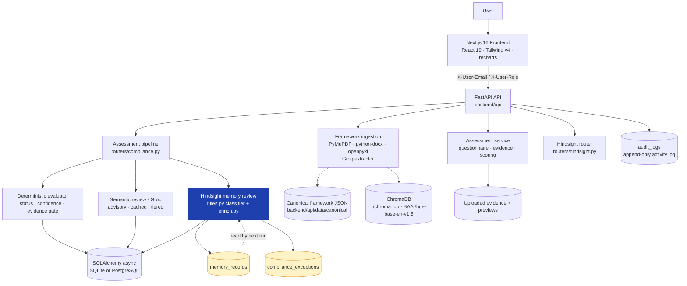

# Cyber Assessment Agent

**A compliance assessment agent that remembers every finding it has ever raised for an organisation — and changes how it reports the next one.**

Built for **HackWithHyderabad 3.0**. FastAPI + Next.js, deterministic evidence grading, and **Hindsight**: a persistent organisational memory layer that turns repeated findings into accumulated operational history.

---

## Table of contents

1. [What this is](#1-what-this-is)
2. [The problem](#2-the-problem)
3. [Why this is different](#3-why-this-is-different)
4. [Hindsight — persistent organisational memory](#4-hindsight--persistent-organisational-memory)
5. [Learning over time (Interaction 1 → 20)](#5-learning-over-time-interaction-1--20)
6. [Trust model: deterministic core, advisory AI](#6-trust-model-deterministic-core-advisory-ai)
7. [System architecture](#7-system-architecture)
8. [Tech stack](#8-tech-stack)
9. [Feature status](#9-feature-status)
10. [End-to-end workflow](#10-end-to-end-workflow)
11. [Real-world use cases](#11-real-world-use-cases)
12. [Data](#12-data)
13. [API surface](#13-api-surface)
14. [Project structure](#14-project-structure)
15. [Setup & running](#15-setup--running)
16. [Environment variables](#16-environment-variables)
17. [Testing](#17-testing)
18. [Security, reliability & limitations](#18-security-reliability--limitations)
19. [HackWithHyderabad 3.0 alignment](#19-hackwithhyderabad-30-alignment)
20. [Demo flow (~60 seconds)](#20-demo-flow-60-seconds)
21. [Roadmap](#21-roadmap)

---

## 1. What this is

Security compliance work is **recurring, evidence-based, and organisational**. The same control fails in the same way, quarter after quarter, in the same business unit. Today that history lives in spreadsheets, ticket threads and one auditor's head.

**Cyber Assessment Agent** runs the assessment (questionnaire, evidence collection, per-control grading, findings, report) and then **keeps the institutional memory**: what failed before, what a human decided about it, which exceptions were approved, which were revoked, and which remediation silently regressed. The next review starts from that history instead of from zero.

**Who it is for:** compliance managers, security managers and internal/external auditors running SOC 2 and NIST CSF 2.0 engagements, plus the control owners who have to produce evidence against document requests.

**What is genuinely novel here:** the memory is not a chat transcript. It is a **deterministic, queryable, organisation-scoped ledger** that is written automatically during the pipeline run, classified by auditable rules, and read back into every report row as `historical_context`.

---

## 2. The problem

### Current problem

| Pain | Where it bites today |
|---|---|
| Every assessment starts blank | A new auditor has no record that CC6.1 failed in Q1 and was closed in Q2 |
| Repeat failures are invisible | A control failing a third time looks identical to a control failing once — it is still just a row in a report |
| Approved exceptions live in email | Nobody can answer "is this deviation still approved?" at review time |
| Evidence gaps are not findings | "We could not check" is treated the same as "it passed" |
| LLM assistants cannot be trusted in an audit | A model opinion rendered as a compliance verdict is an audit finding in itself |

Existing tools do not close this. A GRC platform stores a per-engagement score and nothing else. A RAG chatbot answers the current question and forgets it. A ticketing system knows an incident happened but not that it happened in *this control, with this finding type, in this domain, three times*.

### Our approach

The agent combines five things in one loop:

- **Deterministic evidence grading** — the compliant claim is computed, never generated.
- **Domain data** — canonical framework controls, expected evidence types, question banks.
- **Hindsight persistent memory** — organisation-scoped history of findings, decisions, exceptions and remediation.
- **Advisory LLM layers** — semantic reading of evidence and a narrative on the memory, both contained and never authoritative.
- **Human decisions as first-class data** — accept, reject, escalate, remediate, grant exception.

---

## 3. Why this is different

This system is **not** `retrieve documents → generate answer`.

```text
Assessment run
    ↓
Grade every control deterministically against real evidence
    ↓
For each FAIL / PARTIAL / INSUFFICIENT_EVIDENCE, ask Hindsight:
    "has this organisation failed this control, in this way, before?"
    ↓
Classify deterministically against stored history
    ↓
Attach classification + basis + matched memories to the control row
    ↓
Surface a recurring / escalation / pattern counter in the report summary
    ↓
A human records a decision (accepted / rejected / escalated / remediated / exception)
    ↓
Hindsight stores that outcome as the next run's prior memory
    ↓
The next run is faster to interpret and harder to misread
```

The difference is the last four lines. A retrieval assistant has one turn. This agent has a **ledger that compounds**: interaction *n+1* is cheaper to interpret and more accurate than interaction *n*, because the ambiguity ("is this a new gap or the same gap again?") has already been resolved by a human and written down.

---

## 4. Hindsight — persistent organisational memory

Implemented in `backend/api/compliance/memory/` and surfaced through `backend/api/routers/hindsight.py`.

### 4.1 What it remembers

Hindsight stores one record per **finding** (only `FAIL`, `PARTIAL`, `INSUFFICIENT_EVIDENCE` — a `PASS` is not memory-worthy and `NOT_APPLICABLE` is a scoping decision, not a gap).

| Memory type | Stored value | Source |
|---|---|---|
| **Finding type** | `control_failure`, `partial`, `evidence_gap`, `exception`, `remediation`, `risk_pattern`, `evidence_interpretation`, `human_decision` | `FindingType` enum |
| **Event** | `finding_raised`, `finding_reviewed`, `exception_granted`, `exception_revoked`, `escalated`, `remediation_completed` | `MemoryEvent` enum |
| **Classification** | `NEW_FINDING`, `KNOWN_EXCEPTION`, `RECURRING_FINDING`, `RESOLVED_RECURRING_FINDING`, `ESCALATION_REQUIRED`, `PATTERN_DETECTED` | `MemoryClassification` enum |
| **Occurrence counter** | `1` = first time this control failed this way | computed at write time |
| **Human decision + feedback** | `accepted`, `rejected`, `exception`, `escalated`, `remediated` + free-text rationale | `POST /hindsight/decisions` |
| **Remediation state** | `open`, `acknowledged`, `in_progress`, `remediated`, `accepted` + remediation actions | decision record |
| **Exceptions** | Reason, creator, grant date, expiry, status, revocation trail | `compliance_exceptions` table |
| **Provenance of the decision** | The exact thresholds in force, prior matches, evidence count, confidence, assurance level | `meta` JSON on the record |

Every record is scoped by `organization_id` (case-normalised) and keyed by framework + control + finding type. **A CC6.1 history says nothing about CC8.1** — the retrieval is deliberately narrow, not a similarity search.

### 4.2 The deterministic classifier

`backend/api/compliance/memory/rules.py` is a pure function. Rules are evaluated in a fixed order and the first match wins:

| # | Condition | Label |
|---|---|---|
| 1 | An **active** exception exists for this control | `KNOWN_EXCEPTION` — recorded, never hidden |
| 2 | `occurrence >= MEMORY_ESCALATION_THRESHOLD` (default 3) | `ESCALATION_REQUIRED` |
| 3 | A prior finding on this control was **remediated** and it is failing again | `RESOLVED_RECURRING_FINDING` |
| 4 | `occurrence >= MEMORY_RECURRING_THRESHOLD` (default 2) | `RECURRING_FINDING` |
| 5 | `MEMORY_PATTERN_THRESHOLD` (default 3) **distinct** controls in the domain share this finding type | `PATTERN_DETECTED` |
| 6 | otherwise | `NEW_FINDING` |

Each label ships a human-readable `basis` and the `matched_memories` that produced it, and the thresholds used are persisted on the record — so an auditor can **replay the exact decision** rather than trust it.

**The classifier runs before any model is consulted, and no model output can change it.** A finding with no stored memory is never sent to Groq at all (cost control), so "new" findings are free.

### 4.3 How memory changes the actual report

Memory is an **annotation layer, additive by construction** — it never rewrites a status, a score, a confidence or a severity.

| Where | What memory contributes |
|---|---|
| Every control row | `historical_context`: classification, basis, occurrence, matched memories, enrichment |
| Report recommendation block | Remediation status + remediation actions from the stored memory record |
| Report summary | `recurring` counter — controls classified `RECURRING_FINDING`, `ESCALATION_REQUIRED` or `PATTERN_DETECTED` |
| Pipeline cost ledger | `memory_records_written` |
| Compliance tab (UI) | A **History** column with the classification badge and occurrence counter |

The deterministic `compliance_evaluations` table remains the source of truth. Hindsight reads it, records a row per finding, and never overwrites an evaluation.

### 4.4 Enrichment (advisory, contained)

After classification, Groq may write a structured narration of the relationship to history — `relationship_to_history`, `root_cause_assessment`, `changed_since_last_review`, `escalation_recommendation`, `recommended_actions` (`backend/api/compliance/memory/enrich.py`).

The prompt hard-codes the constraint that matters: *"A deterministic classification and a recorded evaluation status already exist. Do not change, second-guess, or soften them."* Prior memory is passed as **data inside delimited blocks**, explicitly not as instructions.

Every failure degrades to `enrichment: null` with the classification untouched: no API key, timeout, transport error, unparseable JSON, missing keys, or a returned `control_id` that does not match the control under review (a mismatch voids the whole answer).

### 4.5 Guarantees that make it auditable

- **Idempotent.** One memory record per `(evaluation_id, control)`. A double-clicked re-review reports `skipped`, it does not fabricate a second occurrence.
- **Organisation-isolated.** Every read and write filters on `organization_id`; there is a test that proves one organisation's history never appears in another's review.
- **Append-only.** Human decisions always insert a new record; the only mutation of an existing memory row is setting `remediation_status = remediated`.
- **Exceptions expire logically, not just cosmetically.** A lazy batch `UPDATE` flips past-due exceptions to `expired`, and every read additionally re-checks `expires_at`. An expired exception stops shielding the control immediately.
- **A revocation is remembered.** Revoking an exception writes a `exception_revoked` memory record, so "this was waived and the waiver was pulled" is part of the control's history.

### 4.6 Endpoints

| Method & Path | Purpose |
|---|---|
| `POST /assessments/{id}/hindsight/review` | Classify recorded findings against memory (idempotent per evaluation row) |
| `POST /assessments/{id}/hindsight/decisions` | Record a human decision; `exception` also creates a `ComplianceException` |
| `POST /assessments/{id}/hindsight/exceptions` | Grant an approved deviation (optional `expires_at`) |
| `POST /hindsight/exceptions/{id}/revoke` | Revoke before expiry, with a reason |
| `GET /hindsight/organizations/{org}/controls/{code}/history` | Full memory trail + exceptions for one control |
| `GET /hindsight/organizations/{org}/similar-findings?control_id=` | Same finding type on *other* controls |
| `GET /hindsight/organizations/{org}/recurring-findings?threshold=` | Controls repeating a finding at/above a threshold |
| `GET /hindsight/organizations/{org}/risk-summary` | Memory KPIs + recurrence leaderboard |
| `GET /hindsight/organizations/{org}/exceptions?status=` | Exception register |

All Hindsight routes require a **reviewer** role (`org_owner`, `compliance_manager`, `security_manager`, `auditor`).

---

## 5. Learning over time (Interaction 1 → 20)

The learning curve is **not** a demo narrative — each row below is backed by a passing test in `tests/test_memory_api.py`.

| Stage | What the agent does | What it writes / recalls | Test |
|---|---|---|---|
| **Interaction 1** | Handles a fresh control with domain knowledge only. Classifies `NEW_FINDING`, occurrence 1. | Writes the first `memory_records` row. **Does not call the model** (no history to explain). | `test_interaction_1_new_finding` |
| **Interaction 2** | Recognises the same control failing the same way again → `RECURRING_FINDING`, occurrence 2. | Reads the prior record; now has something to explain. | `test_recurring_finding_without_exception` |
| **Interaction ~5** | A human grants an exception. The next occurrence is `KNOWN_EXCEPTION` with occurrence still counted. | Exception row + Groq enrichment, with matched memories listed in `matched_memories`. | `test_interaction_5_known_exception_after_grant` |
| **Interaction ~10** | Human rationale ("Risk accepted by the CISO on Mar 1") is returned verbatim in the control's history. | Decision record with `human_feedback` and `remediation_status`. | `test_human_feedback_persists_and_affects_later_context` |
| **Interaction ~15** | Cross-control view: `similar-findings`, `recurring-findings` and `risk-summary` show the same failure type spreading to other controls. | Recurrence leaderboard; `PATTERN_DETECTED` when a domain-wide cluster forms. | `test_similar_findings_finds_same_type_on_other_controls`, `test_recurring_findings_and_risk_summary` |
| **Interaction ~20** | The exception expires. The control becomes actionable again and the 4th occurrence is `ESCALATION_REQUIRED`. | Expired exception in the register; escalation basis recorded. | `test_interaction_20_escalation_after_expiry` |

**Honest scope note.** What is implemented is the *memory mechanic* — write, retrieve, classify, expire, isolate, and surface. What is **not** implemented is autonomous action-taking on the learner's behalf: the agent never auto-remediates, auto-approves or auto-closes anything. A human decision is always the input that advances the ledger. The full "Interaction 1 → 20" story is demonstrated through the pipeline + the Hindsight API; it is not an autonomous self-training loop.

---

## 6. Trust model: deterministic core, advisory AI

In a compliance tool, the most important architectural decision is **which layer is allowed to make a claim**. Here it is the deterministic engine, and the boundary is enforced in code rather than in a prompt.

```text
Recorded evidence + recorded answers
        ↓
   Deterministic engine  ──►  status · score · confidence · assurance_level   ◄── THE ONLY CLAIM
        ↓
   ┌────────────────────────────┬──────────────────────────────┐
   ↓                            ↓                              ↓
Semantic review (Groq)   Hindsight memory              Evidence normalisation
advisory, cached,         deterministic labels,        format + quality band,
separate fields,          advisory enrichment          never changes a status
```

**Statuses:** `PASS`, `PARTIAL`, `FAIL`, `INSUFFICIENT_EVIDENCE`, `NOT_APPLICABLE`. The last two are deliberate *no-claim* states, so a reader can always tell "we checked and it failed" from "we could not check".

Rules that make a status mean something:

- **No readable evidence text ⇒ `INSUFFICIENT_EVIDENCE`.** A filename or a human summary is not evidence. `PASS` additionally has to clear the framework's pass threshold; contradictory evidence caps the blended score.
- **Every in-scope control always produces a row**, even with no answer and no evidence — coverage is demonstrated, not inferred from absence.
- **`NOT_APPLICABLE` raises no finding.** `FAIL`, `PARTIAL` and `INSUFFICIENT_EVIDENCE` each raise one, back-linked to the evaluation row that caused it.
- **SOC 2 is permanently `TYPE_1`.** Period-based (Type 2) evidence is capped and can never reach `PASS`. `assurance_level` and `asserts_operating_effectiveness` are persisted on every row, so "this result does not claim operating effectiveness" is assertable in a SQL query, not merely implied by an absent field.
- **Re-running supersedes without erasing.** A `run_id` groups a run; `is_current` moves to the newest row per (assessment, control) and the prior claims stay for audit.

---

## 7. System architecture



**Key property:** the write path (`POST /assessments/{id}/assessment-pipeline`) runs deterministic → normalise → semantic → memory and **persists every reading**. The read path (`GET /assessments/{id}/compliance-report`) replays the recorded readings and **never invokes a model**, so dashboards can be refreshed freely at zero cost and the report is stable between runs.

**Database tables (21):** `frameworks`, `domains`, `categories`, `controls`, `questions`, `framework_mappings`, `assessments`, `questionnaires`, `responses`, `evidence`, `followup_questions`, `category_ratings`, `document_requests`, `findings`, `scores`, `users`, `audit_logs`, `compliance_evaluations`, `compliance_semantic`, `memory_records`, `compliance_exceptions`.

---

## 8. Tech stack

| Layer | Technology | Purpose |
|---|---|---|
| Frontend | Next.js 16 (App Router), React 19, Tailwind CSS v4, recharts, lucide-react | Assessment workspace, compliance report, catalog admin, activity log |
| Backend | FastAPI, Uvicorn, Pydantic v2 | REST API, request/response contracts, OpenAPI docs at `/docs` |
| ORM / DB | SQLAlchemy 2.x async, aiosqlite (default) or asyncpg | 21 tables; SQLite file at `backend/api/cyberai.db` |
| Vector store | ChromaDB (local, persistent) | Control-text embeddings for Ask-CyberAI retrieval |
| Embeddings | `BAAI/bge-base-en-v1.5` via sentence-transformers (lazy-loaded) | Control chunk vectors |
| LLM — primary | Groq `openai/gpt-oss-120b` | Semantic review, Hindsight enrichment, evidence pre-fill, control rating |
| LLM — fast tier | Groq `openai/gpt-oss-20b` | Clear-cut controls with strong deterministic coverage |
| LLM — vision | Groq `GROQ_VISION_MODEL` (optional) | Text extraction from uploaded image evidence (PNG/JPG/JPEG) |
| Memory | **Hindsight** — SQL ledger + deterministic rule classifier + optional Groq enrichment | Persistent organisational memory (see §4) |
| Document parsing | PyMuPDF, python-docx, openpyxl, pandas | Framework PDFs, XLSX control matrices, evidence text |
| Tests | pytest + in-process ASGI (`httpx`) | 188 tests, no live network required for the memory/compliance suites |

---

## 9. Feature status

### Implemented

- **Deterministic compliance engine** with five statuses, evidence gating, confidence weighting (volume 0.20 / quality 0.30 / coverage 0.25 / response 0.15 / type-match 0.10) and contradiction caps.
- **Hindsight persistent memory** — full ledger, six-label classifier, enrichment, exceptions with expiry and revocation, org isolation, 9 endpoints, per-control history surfaced in the report and the UI.
- **Assessment pipeline** — one call evaluates every selected framework, normalises evidence, applies advisory semantic + memory review, persists everything, and returns a cost ledger.
- **Advisory semantic review** — Groq, prompt-versioned cache, model tiering, per-call timeout, structured-output validation, invented-control-ID rejection, assurance-overclaim rejection, failures never cached.
- **Framework ingestion** — upload an arbitrary PDF/DOCX/XLSX and get a canonical framework with controls and questions; or import bundled canonical JSON.
- **Assessment lifecycle** — create → scope → assign → questionnaire → answer → evidence → submit → score → findings → report.
- **Document request workflow** — reviewer raises a request, contributor provides documents, reviewer accepts/rejects.
- **Evidence pre-fill and per-category AI rating**, including image evidence via the vision model.
- **Framework catalog admin** (Knowledge Base → Manage) — create/edit/duplicate/move controls with optimistic concurrency (`row_hash`) and an audit history per control.
- **Append-only activity log** with free-text, actor, market and date-range filters.
- **Flat single-organisation RBAC** — six roles, reviewer/contributor separation, assessment-scoped access checks.
- **Reports** — executive dashboard, per-control report, maturity tiers, top gaps, per-framework breakdowns.

### In progress / partial

- **Multi-framework questionnaires** — NIST CSF 2.0 and SOC 2 have canonical JSON committed; CIS Controls v8.1.2, ISO/IEC 27001:2022 and the Organizational Assessment have deterministic builders and generated question banks in `data/outputs/`, but only NIST and SOC 2 ship as loadable canonical files today.
- **PCI DSS 4.0** — the source PDF is present in `data/frameworks/pdf/`, but there is no deterministic parser branch and no evaluation adapter. It can only be ingested through the Groq dynamic extractor.
- **Organisational assessment** — maturity scoring is implemented, but there is no `compliance` adapter, so the Hindsight/compliance layer does not apply to it.

### Planned (not implemented)

- Real authentication (OIDC/JWT) to replace the spoofable header identity described in §18.
- Multi-tenant organisation switching in the UI (the data model is already isolated; the frontend assumes one organisation).
- Vector/embedding search over the Hindsight ledger — currently deliberate, deterministic SQL retrieval.
- Autonomous remediation actions; the ledger currently records human decisions only.
- Alembic migrations (schema is currently created by `create_all` plus lightweight `ALTER TABLE` steps).
- Compliance adapters for CIS Controls v8.1.2, ISO/IEC 27001:2022 and PCI DSS 4.0.
- A dedicated Hindsight screen in the UI (memory is currently surfaced inside the compliance report and the pipeline metrics).
- A UI surface for the AI Questionnaire Designer's advanced `generation_config` (the schema and service support exist; the UI exposes only the default strategy).

---

## 10. End-to-end workflow

```text
1.  Business event
        A control owner uploads an access-review report for CC6.1
                ↓
2.  Agent receives context
        Assessment is scoped to SOC 2 Type 1; evidence is attached to the engagement
                ↓
3.  Retrieve relevant Hindsight memories
        SELECT prior CC6.1 findings (org + framework + control + finding_type)
        SELECT active/expired exceptions on CC6.1
        SELECT same finding type on other controls in the domain
                ↓
4.  Analyze current situation
        Deterministic engine grades CC6.1 from the evidence text alone
        → PARTIAL (contradiction between the questionnaire answer and the report)
                ↓
5.  Use domain tools / data
        Canonical CC6.1 requirement, expected evidence types, pass threshold
                ↓
6.  Classify against history  (before the model is consulted)
        prior evidence_gap × 1, no active exception, occurrence = 2
        → RECURRING_FINDING, basis: "same finding, again"
                ↓
7.  Generate recommendation
        Deterministic remediation text
        + advisory Groq narration of the relationship to the prior finding
                ↓
8.  Capture outcome
        Compliance report row: status PARTIAL, historical_context RECURRING_FINDING,
        summary.recurring incremented, memory_records_written +1
                ↓
9.  Persist useful experience
        memory_records row: finding_type, event, classification, occurrence,
        severity, confidence, basis, matched_memories, thresholds, enrichment
                ↓
10. A human records a decision
        "remediated" → the prior row is marked remediated and a
        remediation_completed event is recorded
                ↓
11. Future interactions benefit
        If CC6.1 fails again, the classifier returns RESOLVED_RECURRING_FINDING —
        "a regression that this recurrence makes visible" — instead of
        asking a human to reconstruct what happened last quarter.
```

---

## 11. Real-world use cases

### 1. The control that keeps failing

- **Situation** — CC6.1 (logical access) is `INSUFFICIENT_EVIDENCE` in the France engagement because the quarterly access-review report was not supplied.
- **Agent action** — the pipeline records `EVIDENCE_GAP`, classifies it `NEW_FINDING`, and attaches the requirement + expected evidence types to the finding.
- **Memory used** — none yet; this is the first occurrence.
- **Outcome** — a finding exists with an evidence requirement attached. Next quarter the same gap returns as `RECURRING_FINDING` with occurrence 2, and on the third occurrence `ESCALATION_REQUIRED`.

### 2. The approved deviation that is about to expire

- **Situation** — an exception was granted 11 months ago for CC7.2 (monitoring), valid for 12 months. The control fails again this quarter.
- **Agent action** — the classifier resolves `KNOWN_EXCEPTION` and reports the exception id in the basis: "an active exception for this control (exc-…) explains the finding; it is recorded but not escalated." Occurrence is still incremented, because an exception explains a finding, it does not erase it.
- **Memory used** — the active exception row plus every prior CC7.2 `control_failure`.
- **Outcome** — the reviewer sees the waiver *and* the count. One month before expiry the next run already knows the control has failed three times.

### 3. A remediation that silently regressed

- **Situation** — a control was closed as `remediated` last quarter. The new evidence shows the same failure mode.
- **Agent action** — `RESOLVED_RECURRING_FINDING`: "This finding was previously remediated and is failing again — a regression that this recurrence makes visible."
- **Memory used** — the prior record's `remediation_status = remediated`, matched explicitly in `matched_memories`.
- **Outcome** — the report distinguishes a regression from a first-time gap. Without the ledger both look like `FAIL`.

### 4. The cluster nobody was tracking

- **Situation** — three access-related controls each fail once, in different domains, over two quarters. No single control looks alarming.
- **Agent action** — `similar-findings` and `recurring-findings` surface the shared finding type; once `MEMORY_PATTERN_THRESHOLD` distinct controls in a domain share it, the classifier emits `PATTERN_DETECTED` — "this is part of a cluster, not an isolated gap".
- **Memory used** — the cross-control query (`finding_type` match, `control_id != current`, same domain).
- **Outcome** — the engagement summary's `recurring` counter rises, and the reviewer is told a pattern exists instead of discovering it by reading 40 rows.

### 5. Scope creep on a repeat framework

- **Situation** — the same organization is assessed against SOC 2 Type 1 and NIST CSF 2.0 in one engagement.
- **Agent action** — one pipeline call evaluates both frameworks through the same adapter-based engine, applies assurance scoping per framework (`TYPE_1` vs `POINT_IN_TIME`), and annotates each control with its own Hindsight history.
- **Memory used** — prior findings per framework; an exception on CC6.1 does not shield the NIST control that covers the same ground, because framework is part of the retrieval key.
- **Outcome** — one report, two frameworks, no duplicated engine and no cross-framework memory bleed.

---

## 12. Data

### Framework source documents (real, in-repo)

| Source | Format | Path | How it enters the system |
|---|---|---|---|
| NIST CSF 2.0 (CSWP 29) | PDF | `data/frameworks/pdf/`, `backend/api/data/raw/` | Deterministic builder `scripts/build_nist_csf_canonical.py` (PyMuPDF, no LLM) |
| SOC 2 TSC 2017 | JSON | `data/frameworks/json/soc2_tsc_2017.json` | Bundled canonical, imported via `POST /frameworks/load-existing` |
| ISO/IEC 27001:2022 | PDF | `data/frameworks/pdf/ISO_IEC-270012022-ed.3.pdf` | Deterministic builder `scripts/build_iso_27001_canonical.py` |
| CIS Controls v8.1.2 | XLSX | `data/frameworks/xlsx/` | Deterministic parser `backend/api/ingestion/parsers/cis_parser.py` |
| PCI DSS 4.0 | PDF | `data/frameworks/pdf/PCI-DSS-v4_0_1.pdf` | No deterministic parser — Groq dynamic extractor only (**planned**) |
| Organizational (Market) Assessment | DOCX/XLSX | `data/frameworks/docx/`, `.../xlsx/` | `backend/api/ingestion/pipeline.py` XLSX branch |

Frameworks can also be uploaded at runtime through the **Groq dynamic extractor** (`backend/ingestion/dynamic_pipeline.py` / `robust_pdf_extractor.py`), which handles arbitrary standards but is LLM-derived and therefore not reproducible.

### Derived / generated data

| Artefact | Location | Produced by |
|---|---|---|
| Canonical framework JSON | `backend/api/data/canonical/`, `data/outputs/canonical_frameworks/` | Deterministic builders (reproducible) |
| Vector chunks | `backend/api/data/chunks/` | One chunk per control |
| Question banks | `backend/api/data/question_bank/`, `data/outputs/questionnaire_bank_*.json` | Questionnaire generator |
| Chroma collection | `chroma_db/` (gitignored, regenerable) | Embedding upload |

### Engagement data

| Data | Location | Nature |
|---|---|---|
| Engagement evidence | `backend/api/data/evidence/<assessment>/` | **Synthetic demo artefacts** generated by `scripts/seed_platform_demo.py` |
| Evidence text previews | `backend/api/data/raw/<uuid>/*.preview.txt` | Extracted text, 20 000 chars/file cap |
| Pre-assessment questionnaires | `backend/api/data/pre_assessments/<assessment>/` + `data/templates/default_pre_assessment.csv` | User-supplied |
| Prowler reports | Generated per document request | **Simulated** — `backend/api/services/prowler_service.py` synthesises a Prowler-style report because the platform has no live cloud accounts. Clearly labelled `Prowler version 4.5.0 (simulated)` in the artefact |

> **Honesty note:** the assessment content, evidence, user directory and Prowler reports in this repository are **synthetic demo data**. The only non-synthetic data is the framework source documents (NIST, ISO, CIS, PCI DSS, SOC 2) and the canonical JSON derived from them. The demo seed is marked as such and every seeded user is an obvious placeholder (`@cyberai.io`).

### What gets written to Hindsight

One `memory_records` row per finding, containing: organization, framework, control code, domain, finding type, event, classification, occurrence, severity, evaluation status, human feedback, remediation status + actions, actor, evidence count, confidence, assurance level, decision basis, matched memories, the thresholds in force, and the optional Groq enrichment. Plus one `compliance_exceptions` row per granted deviation.

---

## 13. API surface

Interactive docs: `http://localhost:8000/docs`. All routes below exist; nothing is aspirational.

### Compliance evaluation

| Method & Path | Purpose |
|---|---|
| `GET /compliance/frameworks` | Frameworks with an evaluation profile, + the drop-in dataset contract |
| `GET /compliance/frameworks/{id}/controls` | Controls resolved exactly as an evaluation will resolve them |
| `POST /assessments/{id}/evaluations` | Run an evaluation (reviewer) |
| `GET /assessments/{id}/evaluations` | Recorded per-control claims; `current_only=false` for history |
| `GET /assessments/{id}/evaluations/summary` | Status counts and coverage per framework |
| `GET /assessments/{id}/evaluation-audit` | Evaluation events from the activity log |
| `POST /assessments/{id}/semantic-review` | Advisory Groq reading. Writes nothing, returns `200` even on model failure |
| `POST /assessments/{id}/assessment-pipeline` | **Write path** — deterministic + normalise + semantic + memory, persisted |
| `GET /assessments/{id}/compliance-report` | **Read path** — recorded readings only, zero model calls |

### Hindsight

See [§4.6](#46-endpoints). Nine routes; all reviewer-gated.

### Frameworks, catalog, assessments

| Method & Path | Purpose |
|---|---|
| `GET /frameworks` · `GET /frameworks/{id}` | List / full domain→category→control→question tree |
| `POST /frameworks/upload` · `POST /frameworks/import-json` | Ingest a framework document / canonical JSON |
| `POST /frameworks/load-existing` | Import every bundled canonical JSON into the DB |
| `DELETE /frameworks/{id}` | Delete a framework (org owner) |
| `GET /catalog/stats` · `GET /catalog/search?q=` | Catalog dashboard stats · global control search (org owner) |
| `GET /catalog/frameworks/{id}/validate` · `…/export` | Validate a framework · export nested JSON |
| `POST /catalog/frameworks/{id}/controls` | Create a control |
| `GET/PATCH/DELETE /catalog/controls/{pk}` | Read / edit (optimistic `row_hash`) / delete a control |
| `POST /catalog/controls/{pk}/duplicate` · `…/move` | Duplicate · move a control |
| `GET /catalog/controls/{pk}/history` | Control audit history |
| `GET/POST /assessments` · `GET /assessments/{id}` · `DELETE /assessments/{id}` | Assessment CRUD |
| `POST /assessments/{id}/assign` | Assign to a reviewer by email |
| `POST /assessments/{id}/generate-questionnaire` | Build the questionnaire (accepts `generation_config`) |
| `POST /assessments/{id}/responses` | Save an answer |
| `POST /assessments/{id}/pre-assessment` · `GET …/download` | Upload / download a pre-assessment questionnaire |
| `GET /pre-assessment/template` | Download the default template CSV |
| `POST /assessments/{id}/evidence-bulk` · `DELETE …?file_name=` | Upload / delete engagement documents |
| `GET /assessments/{id}/engagement-documents` · `…/evidence-requirements` | Engagement documents · required vs uploaded evidence |
| `GET/POST /assessments/{id}/document-requests` | List / raise document requests (reviewer) |
| `POST …/document-requests/{rid}/provide` | Provide documents (contributor) |
| `POST …/document-requests/{rid}/prowler` · `…/prowler/submit` | Generate (simulated) Prowler report · submit it as immutable evidence |
| `POST …/document-requests/{rid}/review` | Accept / reject provided documents (reviewer) |
| `POST /assessments/{id}/prefill` | AI pre-fill answers from engagement documents |
| `POST /assessments/{id}/ai/rate-controls` · `GET …/ai/results` | AI per-category evidence rating · stored results |
| `POST /assessments/{id}/submit` · `POST /assessments/{id}/score` | Submit for review · score and finalize |
| `GET /assessments/{id}/findings` · `…/report` · `…/report-view` | Findings · structured report · dashboard data |
| `GET /document-requests?status=` | Cross-assessment request inbox |
| `GET /activity` · `GET /activity/actions` | Append-only activity log · filter facets |
| `GET/POST /users` · `GET/PATCH/DELETE /users/{email}` · `GET /users/by-role/{role}` · `GET /users-stats` | User management (org owner) |
| `POST /ai/chat` | Ask-CyberAI — grounded, cited answers over framework controls |

---

## 14. Project structure

```text
cyber_prac-main/
├── backend/
│   ├── .env                          ← config + secrets (gitignored)
│   ├── api/                          ← the running FastAPI application
│   │   ├── main.py                   ← 47 inline routes, lifespan, CORS, router splicing
│   │   ├── authz.py                  ← header identity + require_reviewer / _provider /
│   │   │                              require_organization_owner guards
│   │   ├── config.py                 ← settings, absolute paths, memory thresholds
│   │   ├── database.py               ← async engine, session, init_db + light migrations
│   │   ├── models/                   ← SQLAlchemy models (21 tables)
│   │   ├── schemas/                  ← Pydantic contracts
│   │   ├── routers/
│   │   │   ├── compliance.py         ← evaluation / semantic / pipeline / report
│   │   │   ├── hindsight.py          ← 9 Hindsight routes
│   │   │   ├── catalog.py            ← framework catalog admin (org owner)
│   │   │   └── activity.py           ← read-only activity log
│   │   ├── compliance/
│   │   │   ├── enums.py types.py status.py confidence.py evidence.py
│   │   │   ├── evaluator.py normalization.py service.py pipeline.py
│   │   │   ├── adapters/             ← soc2.py (Type 1) · nist.py · registry.py · base.py
│   │   │   ├── semantic/             ← client · grounding · policy · retrieval · service · schema
│   │   │   └── memory/               ← ★ Hindsight: service · rules · enrich · enums · schema
│   │   ├── services/                 ← assessment · framework · scoring · prefill · ai_rating ·
│   │   │                              prowler · report_builder · catalog · activity · platform_catalog
│   │   ├── repositories/             ← data access
│   │   ├── embeddings/ retrieval/ ingestion/   ← Chroma loader, embedder, retriever, parsers
│   │   └── data/                     ← canonical/ raw/ chunks/ evidence/ pre_assessments/ templates/
│   ├── config/settings.py            ← single .env loader, project paths
│   ├── core/                         ← utils.py (LLMClient transport) · evaluation_metrics.py
│   ├── ingestion/                    ← Groq dynamic extractor, robust PDF extractor, cross-mapping
│   ├── services/                     ← questionnaire.py, normalizer.py, chunker.py, rag_pipeline.py
│   ├── exporters/                    ← report_generator.py, xlsx_exporter.py
│   ├── cli/                          ← ingest_frameworks.py, ingest_mapping.py, legacy/
│   └── legacy_web/                   ← original Flask UI, kept for reference, not run
│
├── frontend/                         ← Next.js 16 App Router
│   ├── src/app/                      ← layout, page (AppShell), globals.css
│   ├── src/components/
│   │   ├── layout/                   ← AppShell · Sidebar (role-filtered nav) · Topbar
│   │   ├── auth/LoginView.js
│   │   ├── ui/                       ← Logo, Charts (recharts)
│   │   └── workspace/                ← AssessmentWorkspace, ComplianceTab (Hindsight UI),
│   │                                  ReportsView, AskCyberAIView, OwnersView, InboxView,
│   │                                  ActivityLogView, PolicyLibraryView, knowledge_base/
│   └── src/lib/                      ← api.js (client) · auth.js (roles) · users.js · datetime.js
│
├── scripts/
│   ├── build_nist_csf_canonical.py   ← deterministic NIST canonical builder
│   ├── build_iso_27001_canonical.py  ← deterministic ISO canonical builder
│   ├── load_frameworks.py            ← import canonical JSON via the API
│   ├── seed_platform_demo.py         ← synthetic demo dataset (users, assessments, evidence, AI)
│   ├── seed_platform_extras.py       ← document requests, catalog edits, status variety
│   ├── e2e_test.py                   ← end-to-end API workflow test
│   ├── smoke_evidence_prowler.py     ← Prowler evidence smoke test
│   └── backfill_activity_log.py      ← rebuild the activity log from existing rows
│
├── tests/                            ← 188 pytest tests (9 files)
│   ├── test_memory.py                ← 18 pure classifier / context tests
│   ├── test_memory_api.py            ← 11 HTTP tests incl. the Interaction 1→20 scenarios
│   ├── test_compliance_pipeline.py   ← pipeline + report round-trip, cost ledger
│   ├── test_compliance_semantic.py / _api.py
│   ├── test_compliance_evaluation.py / _service.py / _api.py
│   └── test_compliance_framework_import.py
│
├── data/                             ← source documents, generated questionnaire banks, outputs
├── knowledge_base/                   ← standalone CyberAI-DB reference project the catalog
│                                      admin was ported from — not run by the app
├── docs/AI_QUESTIONNAIRE_DESIGNER_PLAN.md
├── tools/prepare_repo.sh
├── requirements.txt
└── README.md
```

---

## 15. Setup & running

### Prerequisites

- Python 3.11+
- Node.js 18+
- A [Groq API key](https://console.groq.com) — free tier works but is rate-limited. **Optional**: without it the deterministic engine, Hindsight classification and all reporting still work; only the advisory LLM layers and evidence pre-fill degrade.

### Installation

```powershell
# Backend
python -m venv .venv
.\.venv\Scripts\Activate.ps1          # macOS/Linux: source .venv/bin/activate
pip install -r backend\api\requirements.txt
```

```powershell
# Frontend
cd frontend
npm install
```

### Configuration

Create `backend/.env` (gitignored) — at minimum:

```env
GROQ_API_KEY=gsk_your_key_here
GROQ_MODEL=openai/gpt-oss-120b
```

> `backend/.env` is the only `.env` the backend loads. A `.env` at the
> repository root is never read — editing it has no effect.
>
> Groq has decommissioned `llama-3.3-70b-versatile`, `llama-3.1-8b-instant`
> and `mixtral-8x7b-32768`; they return a non-retryable 404/400. `Settings`
> appends currently-served models to every chain, so a stale pin degrades to a
> retry rather than a hard failure.

Everything else has a working default; see [§16](#16-environment-variables).

### Running

Two terminals, from the repo root:

```powershell
# Terminal 1 — API on :8000
python -m uvicorn backend.api.main:app --reload --port 8000
```

```powershell
# Terminal 2 — UI on :3000
cd frontend
npm run dev
```

- App: **http://localhost:3000**
- OpenAPI docs: **http://localhost:8000/docs**

First run: load the bundled frameworks (the Frameworks page → *Load existing*, or):

```powershell
curl -X POST http://localhost:8000/frameworks/load-existing
```

> Accessing from another device? Start the backend with `--host 0.0.0.0`. The frontend targets the page's own hostname on port 8000 by default; override with `NEXT_PUBLIC_API_BASE`. CORS allows localhost and private LAN origins.

### Demo data (optional, synthetic)

```powershell
# Full synthetic dataset: users for every role, assessments across frameworks,
# evidence, AI pre-fill and rating, scored + reported
python scripts\seed_platform_demo.py --no-ai

# --reset  delete existing assessments and seeded users first
# --no-ai  skip Groq pre-fill / rating (much faster)

# Then: document requests, catalog edits, status variety
python scripts\seed_platform_extras.py
```

---

## 16. Environment variables

Set in `backend/.env` (gitignored). All are optional except `GROQ_API_KEY` for the LLM layers.

| Variable | Default | Purpose | Required |
|---|---|---|---|
| `GROQ_API_KEY` | — | LLM access (semantic review, Hindsight enrichment, pre-fill, rating, vision) | For LLM features |
| `GROQ_MODEL` | `openai/gpt-oss-120b` | Primary model. Live fallbacks are appended automatically | No |
| `GROQ_FAST_MODEL` | `openai/gpt-oss-20b` | Cheap tier for clear-cut controls | No |
| `GROQ_MODEL_FALLBACKS` | — | Extra comma-separated fallbacks, tried after `GROQ_MODEL` | No |
| `GROQ_VISION_MODEL` | — | Vision model for image-evidence pre-fill. Empty = image pre-fill skipped | No |
| `GROQ_SEMANTIC_TIMEOUT` | `45` | Hard ceiling (s) on one semantic call | No |
| `GROQ_SEMANTIC_BATCH_SIZE` | `5` | Controls per batched semantic request | No |
| `GROQ_MEMORY_TIMEOUT` | `45` | Hard ceiling (s) on one Hindsight enrichment call | No |
| `SEMANTIC_VECTOR_RETRIEVAL` | `false` | Use the Chroma stack to rank controls. **Off by default** — `sentence-transformers` is a heavy optional dep that can segfault on import rather than raise; ranking falls back to a deterministic lexical scorer | No |
| `MEMORY_RECURRING_THRESHOLD` | `2` | Occurrence count at which a finding becomes `RECURRING_FINDING` | No |
| `MEMORY_ESCALATION_THRESHOLD` | `3` | Occurrence count at which it becomes `ESCALATION_REQUIRED` | No |
| `MEMORY_PATTERN_THRESHOLD` | `3` | Distinct same-domain controls needed for `PATTERN_DETECTED` | No |
| `MEMORY_ENRICH_ENABLED` | `true` | Allow Groq to write the advisory enrichment narrative | No |
| `DATABASE_URL` | SQLite at `backend/api/cyberai.db` | `postgresql://…` is rewritten to `asyncpg`; unset/placeholder falls back to SQLite | No |
| `CHROMA_PATH` | `./chroma_db` | Local Chroma directory, resolved against the repo root | No |
| `PREFILL_TPM_LIMIT` | `5500` | Tokens-per-minute throttle for evidence pre-fill | No |
| `PREFILL_BATCH_SIZE` | `5` | Questions per pre-fill LLM request | No |
| `DEBUG` | `false` | Debug flag | No |
| `NEXT_PUBLIC_API_BASE` (in `frontend/.env`) | page host on `:8000` | Frontend → API base URL | No |

Data folders (`raw/`, `canonical/`, `chunks/`, `evidence/`, `pre_assessments/`, `templates/`) are resolved **absolutely** from `backend/api/data/`, so the server behaves identically regardless of the working directory. The embedding model (`BAAI/bge-base-en-v1.5`) is hard-coded and lazy-loaded, not configurable.

---

## 17. Testing

```powershell
python -m pytest tests -q
```

**Current result: 188 passed** (~113 s, no live Groq key required for the memory, compliance-engine and API-contract suites — they inject a stub LLM client).

| Suite | What it proves |
|---|---|
| `test_memory.py` (18) | Classifier rule order, thresholds, exception expiry semantics, context rendering, prompt-injection framing of memory as data |
| `test_memory_api.py` (11) | The Interaction 1→20 scenarios, review idempotency, org isolation, human-feedback persistence, enrichment failure containment, exception grant/revoke |
| `test_compliance_pipeline.py` | Pipeline write path, report read path, the 12 required control-row fields, `memory_records_written > 0` on run and `== 0` on read |
| `test_compliance_semantic.py` / `_api.py` | Structured-output validation, invented-control-ID rejection, assurance-overclaim rejection, cache-hit accounting, timeout containment |
| `test_compliance_evaluation.py` / `_service.py` / `_api.py` | Status derivation, evidence gating, confidence weights, run supersession |
| `test_compliance_framework_import.py` | Canonical JSON import paths |

End-to-end against a live server (15 stages, no browser):

```powershell
python scripts\e2e_test.py
```

> Groq free-tier pre-fill and rating can time out. Those steps are reported `[WARN]`, not `[FAIL]`, because a quota timeout is a rate-limit property, not a code defect.

---

## 18. Security, reliability & limitations

### What is actually implemented

| Safeguard | Where |
|---|---|
| **Role-based access control** | `backend/api/authz.py` — 6 roles, reviewer / contributor / provider gates, per-route dependencies |
| **Contributor boundary** | Contributors can provide documents but are blocked (`403`) from scores, findings, reports and AI results |
| **Assessment-scoped access** | Reviewers and contributors only reach engagements they are assigned to (`caller_can_access`) |
| **Org owner-only admin** | User management and framework catalog mutations |
| **Input validation** | Pydantic v2 throughout; `extra="forbid"` on the pipeline and semantic request bodies; `min_length` on exception reasons; `Literal` on decisions and statuses |
| **Read-only activity log** | `routers/activity.py` exposes GET only — no create/update/delete route exists by construction |
| **Append-only Hindsight** | Decisions insert; only `remediation_status` is ever mutated on an existing row |
| **Exception expiry** | Lazy batch `UPDATE` + a second `is_active` check on every read |
| **Advisory-LLM containment** | No key / timeout / transport / parse / validation failure all degrade to "no opinion", never a `5xx`; the route still returns `200` |
| **Failure isolation** | Per-collection retrieval failures are caught; one slow control cannot stall a run (daemon thread + outer deadline) |
| **Secret management** | `.env` is gitignored; `*.db`, `chroma_db/`, `backend/api/data/raw|evidence|chunks/` are gitignored |
| **Optimistic concurrency** | Catalog control edits carry a `row_hash` so a lost update is detected rather than silently applied |
| **Assurance scoping** | `assurance_level` + `asserts_operating_effectiveness` persisted per row, assertable in SQL |

### Known limitations

- **Authentication is spoofable by design.** Identity comes from `X-User-Email` / `X-User-Role` request headers, and a caller who sends no `X-User-Role` is treated as *permissive* (this keeps SSR, curl and the test suite working). The gates stop the honest UI from reaching another organisation's data; they do not stop a determined attacker. **Real OIDC/JWT authentication is the top roadmap item.**
- **Single organisation.** The data model isolates by `organization_id`, but the frontend assumes one organisation and there is no tenant switcher.
- **Memory retrieval is deterministic SQL, not semantic.** That is a deliberate correctness choice — a control's history is a lookup, not a similarity guess — but it means Hindsight currently returns matches by `(org, framework, control, finding_type)`, not by meaning.
- **A `PATTERN_DETECTED` label can only fire on a control's first occurrence**, because rules 2 and 4 (escalation, recurrence) are evaluated first and both trigger at `occurrence >= 2` with default thresholds. This is a consequence of the fixed rule order, not a bug, and is asserted by `test_pattern_detected_across_distinct_controls_same_domain`.
- **The pipeline's memory guard is unconditional.** `include_memory_review=false` controls whether the Groq *enricher* is constructed; the deterministic classification still runs.
- **No rate limiting** on the API itself (only the internal Groq TPM throttle). No request-size limits beyond the per-file evidence preview cap.
- **Legacy code is still in-tree** — `backend/legacy_web/` (Flask), `backend/cli/legacy/`, `knowledge_base/` — kept for reference, not executed.
- **No Alembic.** Schema is created by `create_all` plus a small set of `ALTER TABLE` steps in `database.py`.

---

## 19. HackWithHyderabad 3.0 alignment

### Innovation — 30%

The product idea is not "AI that answers compliance questions". It is a **compliance workflow agent whose judgement is backed by an organisational ledger**: recurring failures, approved deviations, granted-and-then-revoked exceptions, and remediation regressions become first-class, queryable, org-scoped data that changes how the *next* assessment is read. The differentiator is a closed loop (run → classify against history → record human outcome → better next read), not a single-shot generation step. The memory is deliberately **deterministic** rather than an LLM summarisation of chat history, which is what makes it auditable and therefore usable in an assurance context at all.

### Hindsight memory — 25%

Memory is the architectural centre, not a feature:

- **Automatic** — written by the pipeline itself, not by a user remembering to log something.
- **Typed** — a closed vocabulary of finding types, events, classifications and remediation states, not free text.
- **Rule-classified** — six labels produced by a pure function with a fixed priority order and configurable thresholds; a model cannot change a label.
- **Provenance-preserving** — every record stores its `basis`, its `matched_memories` and the exact thresholds in force, so a decision can be replayed months later.
- **Queryable** — control history, similar findings, recurring findings, risk summary, exception register.
- **Isolated and expiring** — organisation-scoped, with exceptions that stop shielding a control the moment they lapse.
- **Demonstrable** — the Interaction 1→20 progression is a passing test suite, not a claim.

### Technical implementation — 20%

Clean layered FastAPI (routers → services → repositories → models), 21 SQLAlchemy tables, Pydantic v2 contracts throughout, async I/O, an OpenAPI surface, and a full Next.js 16 client. The engineering judgement shows up in the failure design: advisory layers **degrade** rather than raise, the deterministic engine is the only claimant, cost is a first-class ledger (`avoided_llm_calls`, `cache_hits`, `memory_records_written`), model tiering and prompt-versioned caching are implemented, and structured output is validated in code. **188 automated tests** (175 test functions across 9 files) cover the memory rules, the evaluation engine, the pipeline, the semantic contract and the HTTP API.

### User experience — 15%

The user does not operate a memory system. They click **Run Pipeline** in the compliance tab and get a table where a new **History** column shows `RECURRING_FINDING · A-3` next to a `FAIL`. The complexity is absorbed: the framework tree, questionnaire, evidence collection, document-request workflow, scoring and reporting all live in one workspace, and the contributor side ("My Work") is a single inbox rather than a portal.

### Real-world impact — 10%

Compliance teams lose weeks per cycle to reconstructing history, and repeat findings are the single largest source of remediation rework. Being able to say, at review time, "this is the fourth time CC6.1 has failed this way, it was remediated in Q1, the waiver expired last month" converts a reporting problem into a manageable operational one — and it is exactly the kind of claim an auditor can check, because the platform stores why it said it.

---

## 20. Demo flow (~60 seconds)

Run against a seeded engagement in the **Compliance** tab. Every step below is implemented; the timings are indicative.

```text
1  Open an assessment scoped to SOC 2 Type 1
      → "Run Pipeline"
      → CC6.1 lands as INSUFFICIENT_EVIDENCE (no access-review report was supplied)
      → History column: NEW_FINDING, A-1
      → Cost ledger: "Memory records written: 1"
      → Note: no model call — there was no history to explain

2  Repeat the same engagement
      → History column: RECURRING_FINDING, A-2
      → basis: "same finding, again"
      → summary tile: "… 1 recurring"

3  POST /assessments/{id}/hindsight/decisions
      {"decision": "remediated", "human_feedback": "Automated access reviews enabled 12 May"}
      (or {"decision": "exception", "reason": "Supplier migration, expires in 90 days"})

4  Show it stored
      → GET /hindsight/organizations/<org>/controls/CC6.1/history
      → the decision row with the exact human_feedback text

5  Run the pipeline again on a DIFFERENT control in the same domain
      → similar-findings shows CC6.1 already failed this way

6  Advance the state to expose the escalation
      → (a) mark the exception expired, or
        (b) simply run until occurrence hits MEMORY_ESCALATION_THRESHOLD
      → History column: ESCALATION_REQUIRED, A-4
      → basis names the occurrence count and the threshold that fired
```

**If time is short:** steps 1 → 2 → 6 alone tell the whole story — the same control, the same failure, and a materially different reading the fourth time.

**If judges ask "is the memory just the database?"** — no. The database stores rows. The value is the **classification**: the system decided, by rule and with replayable provenance, that this is not a new gap but a *fourth* occurrence of one it has already been told about, and it did so without a model. `GET /hindsight/organizations/{org}/recurring-findings` and `risk-summary` are the same ledger read back as an operational priority list.

---

## 21. Roadmap

### Current

Deterministic compliance engine, full Hindsight memory layer, multi-framework assessment pipeline, advisory semantic review, framework ingestion and catalog admin, complete assessment/evidence/document-request workflow, activity log, RBAC, reports, 188 passing tests.

### Next (before the hackathon demo)

- A dedicated **Hindsight panel** in the UI — control history timeline, exception register, recurrence leaderboard — instead of memory living only inside the compliance report.
- A scripted **demo seeding path** for the 1 → 2 → escalate sequence so the loop can be shown repeatably.
- Metrics on the compliance report: mean occurrences per control and mean time-to-remediation, both derived from the ledger.
- Fix the `PATTERN_DETECTED` ordering so a domain-wide cluster is detectable on a repeat occurrence, not only on a first one.

### Future

- OIDC/JWT authentication and server-issued sessions, retiring the header identity.
- Multi-tenant UI with an organisation switcher over the already-isolated data model.
- Compliance adapters for CIS Controls v8.1.2, ISO/IEC 27001:2022 and PCI DSS 4.0.
- Semantic retrieval *alongside* the deterministic one, for "find similar problems", keeping the deterministic path authoritative.
- Alembic migrations and a real PostgreSQL deployment target.
- Integration with real evidence sources (ITSM ticketing, cloud scanning) to replace the simulated Prowler path.
- Autonomous follow-up: the agent drafts the remediation request and the exception request, a human approves — the ledger still only advances on human input.
